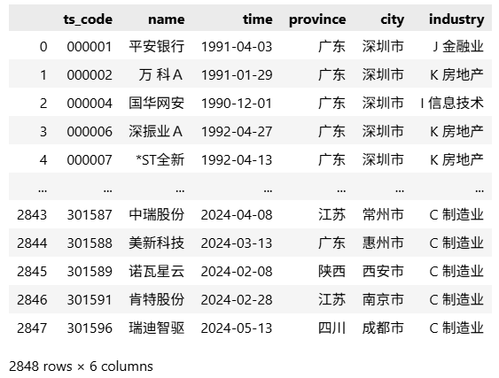
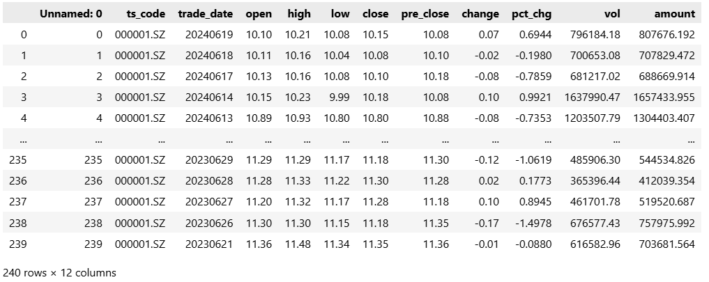
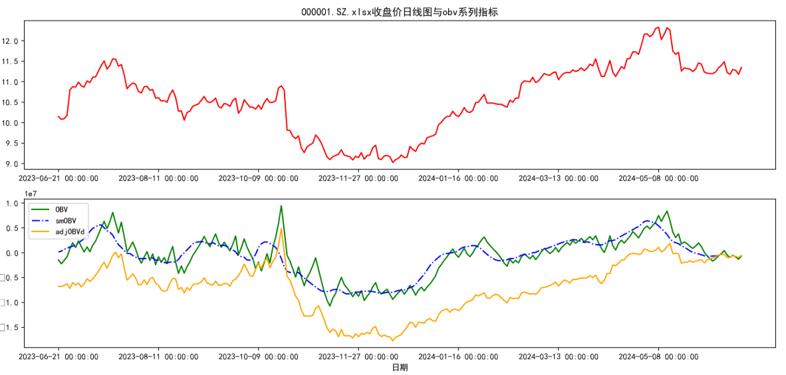
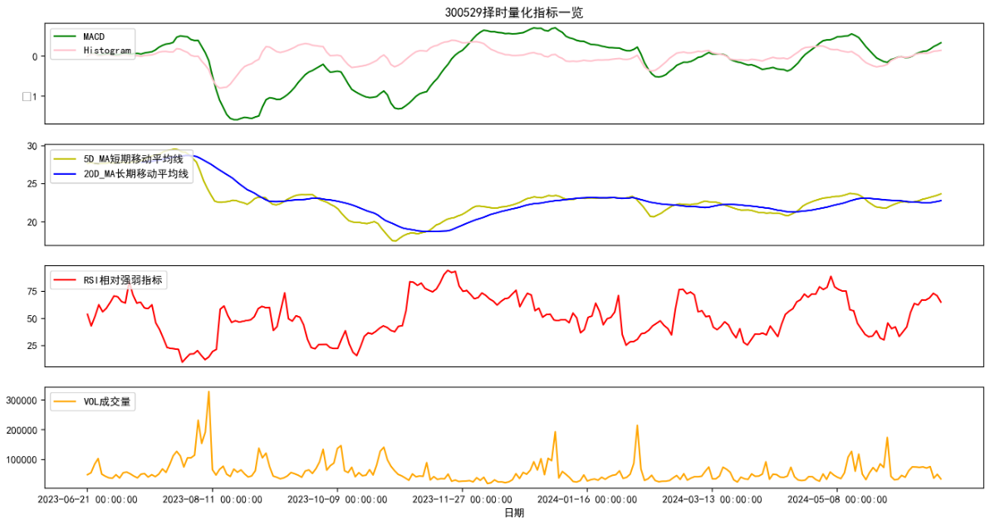
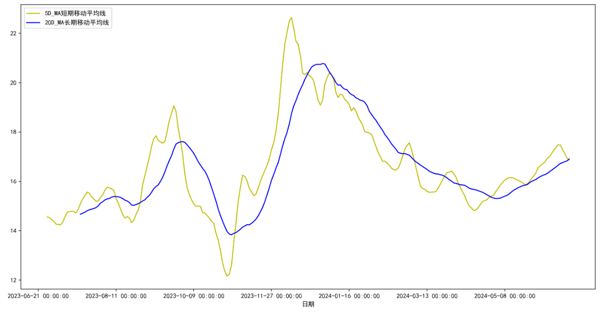

# 深市股票量化交易系统
该项目未为**算法交易课程**实践项目，基于Python+Tushare Pro实现的**深市股票量化交易分析系统**，支持股票历史数据自动化抓取、多维度技术指标计算、量价关系可视化分析，并提供配套的选股/择时策略参考，为量化投资提供数据支撑与决策依据。

本项目实现了从**数据获取-预处理-指标计算-可视化分析**的完整量化分析流程，同时补充了算法交易核心问题的解答，可作为量化交易入门学习与实战参考的基础项目。

## 项目简介
本系统以**深圳证券交易所**上市股票为分析对象，依托Tushare Pro金融数据接口，结合Python数据分析生态（Pandas/Matplotlib），实现股票日线数据的批量获取、清洗与多类经典技术指标的自动化计算，并通过可视化图表直观展示股票价格走势与市场资金行为。

同时，项目配套设计了基于财务指标与技术指标的**选股策略**，以及结合趋势、波动率、量价关系的**择时策略**，并分析了系统局限性与优化方向，形成一套完整的量化交易分析框架。

### 核心目标
1. 实现金融数据的自动化获取与标准化预处理，降低量化分析的入门成本；
2. 计算经典技术指标，量化股票的趋势、波动、超买超卖、资金流向等特征；
3. 结合技术指标与财务指标，制定可落地的选股、择时策略；
4. 可视化股票价格与指标走势，直观反映市场行为与价格的关联关系。

### 技术栈
| 模块         | 工具/库/接口                     | 核心作用                     |
|--------------|---------------------------------|------------------------------|
| 数据获取     | Tushare Pro API                 | 抓取深市股票基本信息与日线数据 |
| 数据处理     | Pandas                          | 数据清洗、格式化、指标计算   |
| 可视化分析   | Matplotlib                      | 绘制价格、指标走势图表       |
| 编程语言     | Python3.8+                      | 项目核心开发语言             |
| 数据存储     | Excel/CSV/HDF5                  | 离线存储处理后的数据         |

## 系统架构与核心实现
整体流程：`股票数据获取 → 数据清洗与预处理 → 技术指标计算 → 数据存储 → 可视化分析 → 策略制定`
### 1. 数据获取与预处理
#### 1.1 数据获取
通过Tushare Pro API实现两类数据的自动化抓取，覆盖深市股票分析的基础数据需求：
- **股票基本信息**：深市所有正常交易股票的代码、名称、行业分类等；
- **股票日线数据**：单只股票近一年的开盘价、收盘价、最高价、最低价、成交量、成交额等核心行情数据。

#### 1.2 数据预处理
利用Pandas对原始数据进行清洗与格式化，保证数据的一致性和可分析性，核心操作：
- 删除无用列，保留分析所需核心字段；
- 转换日期格式为`datetime`，并设置为DataFrame索引，适配时间序列分析；
- 处理缺失值、异常值，保证数据完整性；
- 标准化字段命名，提升代码可读性。
<div align="center">
  
  
</div>

### 2. 核心技术指标计算
系统实现了**6大类经典量化技术指标**的自动化计算，覆盖趋势、波动、超买超卖、资金流向等维度，为策略制定提供量化依据，所有指标均基于Pandas向量化计算实现，保证运行效率。

#### 2.1 波动率指标
通过**对数收益率**计算每日价格波动，结合**20日滚动窗口标准差**计算股票波动率，用于评估股票的投资风险水平：
$$r_t = \ln(\frac{Close_t}{Close_{t-1}})$$
$$Volatility_{20} = \sigma(r_t, window=20)$$

#### 2.2 趋势类指标
- **移动平均线（MA）**：计算5日短期均线、20日长期均线，追踪股票价格趋势，判断趋势方向；
- **MACD指标**：计算短期（12日）与长期（26日）指数移动平均线（EMA）的差值（DIF）、信号线（DEA）、MACD柱，判断市场趋势与多空转换。

#### 2.3 超买超卖指标
- **相对强弱指数（RSI）**：计算14日RSI，通过股价上涨与下跌的平均幅度比率，判断股票是否处于超买（RSI>70）或超卖（RSI<30）状态。

#### 2.4 资金流向指标
基于成交量计算资金流向相关指标，反映市场参与度与资金动向：
- **累积成交量指标（OBV）**：根据收盘价涨跌累加成交量，判断量价配合关系；
- **平滑移动平均OBV（smOBV）**：对OBV进行移动平均，平滑短期波动，识别长期资金趋势；
- **修正累积成交量指标（AdjOBVd）**：对原始OBV进行修正，更精准反映资金实际流向。

### 3. 数据存储
支持将处理后的**股票基础数据+计算后的技术指标**导出为多格式文件，满足离线分析、策略二次开发需求：
- 核心格式：Excel/CSV，适配常规数据分析工具；
- 拓展格式：HDF5，适配大数据量的高效存储与读取；
- 支持批量导出，按股票代码分类存储，便于数据管理。

### 4. 可视化分析
利用Matplotlib实现**价格走势与技术指标的联动可视化**，直观展现指标与股票价格的关联关系，核心可视化图表包括：
- 股票收盘价+5日/20日移动平均线趋势图；
- 收盘价走势与OBV/smOBV/AdjOBVd资金流向指标联动图；
- RSI指标走势（标注超买/超卖阈值线）；
- MACD指标（DIF、DEA、MACD柱）走势；
- 20日波动率趋势图。

<!-- 插入可视化图表合集，一行3图布局 -->
<div align="center">
    
    
</div>
<div align="center">
    
</div>

## 量化交易策略
本系统基于计算的技术指标与股票财务指标，设计了**选股策略**与**择时策略**两套核心策略，策略逻辑贴合市场实际，可直接落地测试与优化。

### 1. 选股策略
**核心依据**：**财务健康度+业绩增长性**，筛选估值合理、业绩向好的深市股票，聚焦价值低估与潜在增长标的。
#### 筛选指标
- **估值指标**：市盈率（PE）、市净率（PB）（低估值优先，避免高溢价）；
- **分红指标**：股息率（高股息率优先，反映公司现金流充裕、分红能力强）；
- **增长指标**：每股收益（EPS）增长率、营业收入增长率（业绩持续增长优先）。
#### 选股逻辑
1. 筛选深市正常交易股票，剔除ST、停牌标的；
2. 按PE/PB从低到高排序，选取前30%标的；
3. 筛选股息率>2%、EPS增长率/营业收入增长率>0的标的；
4. 结合行业分类，分散配置，避免单一行业集中风险。

### 2. 择时策略
**核心依据**：**趋势跟随+波动率调整+量价关系+超买超卖**，确定股票的最佳买卖点，最大化投资回报，控制市场风险。
#### 核心策略逻辑
1. **趋势跟随**：5日均线上穿20日均线形成**金叉**→ 买入信号；5日均线下穿20日均线形成**死叉**→ 卖出信号，跟随市场主流趋势；
2. **波动率调整**：波动率放大时（20日波动率>近期均值）→ 减仓控制风险；波动率缩小时→ 适当加仓把握盈利机会；
3. **量价关系**：价格上涨伴随成交量放大→ 有效上涨，持有/加仓；价格上涨但成交量萎缩→ 假突破，减仓/卖出；
4. **超买超卖修正**：RSI>70→ 超买，逢高减仓；RSI<30→ 超卖，逢低加仓，避免在市场极端情绪下决策。

## 算法交易核心问题解答
本项目配套整理了算法交易入门的**10大核心问题**，覆盖资金识别、筹码分析、市场周期、多空策略、AI应用等维度，为量化交易策略开发提供理论支撑，核心问题如下（详细解答见项目文档）：
1. 算法交易的利润来源；
2. 资金进入的5种核心识别方法；
3. 股票筹码的识别方法与关键指标；
4. 市场周期判断的6类技术指标与方法；
5. 多空交易的核心盈利策略；
6. 期现模型（期货+股票）的类型与前提条件；
7. 主力行为的判断方法；
8. 金融时间序列预测方法及缺点；
9. AI在金融分析中的核心应用思路；
10. 文本分析在量化交易（事件驱动）中的应用思路。

## 系统功能与价值
### 核心功能
- ✅ **自动化数据获取**：一键抓取深市股票基础信息与日线数据，无需手动整理；
- ✅ **多指标批量计算**：6大类经典技术指标自动化计算，支持指标参数自定义；
- ✅ **数据多格式存储**：支持Excel/CSV/HDF5导出，满足离线分析与二次开发；
- ✅ **可视化分析**：价格与指标联动绘图，直观反映市场行为；
- ✅ **量化策略参考**：提供完整的选股、择时策略，可直接落地测试；
- ✅ **理论支撑**：配套算法交易核心问题解答，夯实量化交易理论基础。

### 项目价值
1. **入门学习**：为量化交易初学者提供从数据到策略的完整实战框架，理解量化分析的核心流程；
2. **策略开发**：提供标准化的数据分析模板，可基于此拓展更多技术指标与复杂策略；
3. **投资参考**：为个人投资者提供客观的量化分析依据，替代主观经验判断，提升决策科学性；
4. **二次开发**：代码结构清晰，易拓展，可对接实时数据接口、机器学习模型，升级为智能量化交易系统。

## 环境配置与运行说明
### 1. 环境依赖安装
```bash
# 安装核心依赖库
pip install tushare pandas matplotlib openpyxl numpy
```

### 2. Tushare Pro配置
1. 注册[Tushare Pro账号](https://tushare.pro/)，完成实名认证，获取**个人token**；
2. 在项目代码中配置token，实现数据接口连接：
   ```python
   import tushare as ts
   # 配置Tushare Pro token
   ts.set_token('你的Tushare Pro Token')
   pro = ts.pro_api()
   ```
3. 注意：Tushare Pro部分数据需消耗积分，建议根据需求升级积分等级。

### 3. 运行步骤
1. 克隆本项目到本地：
   ```bash
   git clone https://github.com/你的用户名/Quant-Trading-SZSE.git
   cd Quant-Trading-SZSE
   ```
2. 在`config.py`中配置Tushare Token、股票代码、分析时间范围等参数；
3. 运行主程序`main.py`，自动执行**数据获取-预处理-指标计算-存储-可视化**；
4. 在`data/`目录下查看处理后的数据，在`images/`目录下查看生成的可视化图表；
5. 参考`strategy/`目录下的选股、择时策略代码，进行策略测试与优化。

## 系统局限性与改进建议
### 现有局限性
1. **数据实时性**：当前仅支持历史日线数据获取，无实时行情数据接口，无法适配高频交易策略；
2. **策略复杂度**：以经典技术指标为主，未引入机器学习/深度学习模型，策略效果受市场环境影响较大；
3. **异常处理**：数据处理过程中对异常值、缺失值的处理逻辑较简单，极端市场数据可能影响分析结果；
4. **资源效率**：代码存在部分重复读取数据的操作，大数据量下运行效率有待提升；
5. **回测功能**：无策略回测模块，无法量化评估选股/择时策略的历史收益与风险。

## 总结
本深市股票量化交易系统依托Tushare Pro的丰富金融数据，实现了从数据获取到策略制定、经典技术指标的自动化计算与可视化分析，并设计了贴合市场的选股、择时策略，为量化投资提供了坚实的**数据支撑+策略参考+理论基础**。

